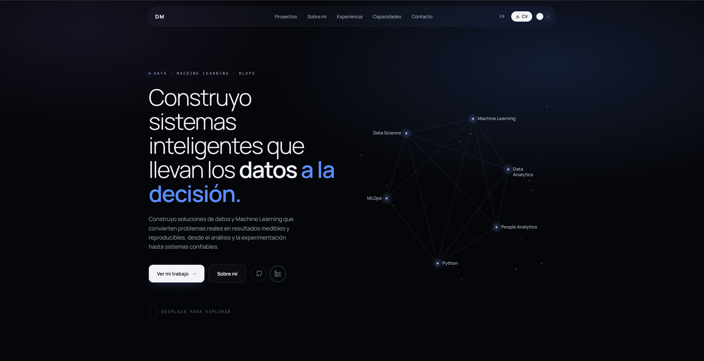
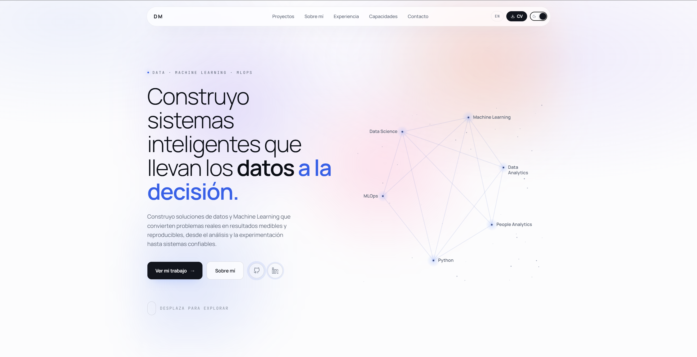

# Dereck Mendez — Portafolio

_Data Science · Machine Learning · MLOps_

[](https://ayorick23.github.io)


**[→ ayorick23.github.io](https://ayorick23.github.io)**

---

## Por qué este portafolio

Mi camino hacia los datos no empezó en un rol de datos. Vengo de operaciones de negocio y analítica de personas/RR. HH., y desde ahí avancé hacia Data Science, Machine Learning y, cada vez más, hacia el lado de ingeniería del ML (MLOps): tracking de experimentos, versionado de datos, testing, contenedores, despliegue.

Una plantilla genérica o un CV en PDF no podían mostrar ese camino ni la forma en que trabajo. Lo que quería en su lugar era un sitio que:

- Presente casos de estudio reales y end-to-end — no solo una lista de herramientas — para que el razonamiento detrás de un proyecto (la pregunta de negocio, el enfoque, los trade-offs) sea visible, no solo el resultado.
- Refleje la forma en que realmente construyo: reproducible, testeado, versionado — los mismos estándares que aplico a un notebook o un pipeline, aplicados aquí a un codebase.
- Hable inglés y español de forma nativa, ya que mi trabajo ocurre en ambos idiomas.
- Sea algo que controlo por completo — el código, el contenido y el pipeline de despliegue — en vez de un builder alquilado.

Este repositorio es ese sitio: un codebase en Astro + TypeScript + Tailwind CSS, construido a mano y autodesplegado en GitHub Pages.

## Capturas de pantalla



_Hero — modo oscuro (default)_



_Hero — modo claro_

## Stack técnico

|                    |                                                                                                                                                                             |
| ------------------ | --------------------------------------------------------------------------------------------------------------------------------------------------------------------------- |
| **Framework**      | [Astro](https://astro.build) 7 — arquitectura de islas, cero JS de cliente por defecto, `<ClientRouter />` para las transiciones entre páginas                              |
| **Lenguaje**       | TypeScript, con schemas estrictos de content collections vía [Zod](https://zod.dev)                                                                                        |
| **Estilos**        | [Tailwind CSS v4](https://tailwindcss.com) (`@theme inline`, sin archivo de config — los tokens viven en `src/styles/global.css`)                                          |
| **Contenido**      | Content collections de Astro (`src/content/projects/{en,es}`) — casos de estudio como Markdown tipado                                                                      |
| **Íconos**         | [astro-icon](https://github.com/natemoo-re/astro-icon) con un set local de SVGs (`src/assets/icons/`) + [Iconify](https://iconify.design) (`lucide`, `simple-icons`, `logos`) |
| **Fuentes**        | [Fontsource](https://fontsource.org) — Manrope Variable (display/body) + JetBrains Mono (labels/código)                                                                     |
| **SEO / Social**   | `@astrojs/sitemap`, más portadas propias para og:image generadas con `@napi-rs/canvas` (ver "Portadas para redes sociales" en Funcionalidades notables)                     |
| **Hosting / CI**   | GitHub Pages, build y deploy automático vía GitHub Actions en cada push a `main`                                                                                            |

No se usa ningún framework de UI (React/Vue/Svelte) — las piezas interactivas (tema, idioma, constelación del hero, timeline, portadas de proyecto) son módulos de TypeScript plano, cargados desde tags `<script>` en los `.astro` que los necesitan.

## Estructura del proyecto

```plaintext
ayorick23.github.io/
├── docs/
│   └── screenshots/                # Capturas usadas en este README
├── public/
│   ├── cv/                          # CVs descargables en PDF (por idioma)
│   ├── og/                          # Portadas sociales generadas (og:image)
│   └── projects/                    # Imágenes reales de cada caso de estudio
├── scripts/
│   └── generate-og-images.mjs       # Genera las portadas de public/og/ (manual, no forma parte del build)
├── src/
│   ├── assets/
│   │   ├── icons/                   # Set local de íconos SVG (astro-icon)
│   │   └── images/                   # Foto de perfil y demás rasters
│   ├── components/
│   │   ├── views/                    # Contenido real de cada página
│   │   │   ├── HomeView.astro
│   │   │   ├── AboutView.astro
│   │   │   ├── ExperienceView.astro
│   │   │   └── ProjectsIndexView.astro
│   │   ├── Nav.astro, Footer.astro, ThemeToggle.astro, LanguageSwitcher.astro
│   │   ├── Constellation.astro, Timeline.astro
│   │   ├── ProjectCard.astro, ProjectCover.astro
│   │   └── ...
│   ├── content/
│   │   ├── projects/
│   │   │   ├── en/*.md               # Casos de estudio, inglés
│   │   │   └── es/*.md               # Casos de estudio, español (mismos slugs)
│   │   └── i18n/
│   │       ├── en.ts, es.ts           # Todo el copy de la interfaz — los componentes nunca hardcodean texto
│   │       └── types.ts               # Forma compartida que ambos idiomas deben cumplir
│   ├── content.config.ts             # Schema Zod de la collection de proyectos
│   ├── data/                         # Datos estructurales sin idioma
│   │   ├── nav.ts, social-links.ts, tools.ts, constellation.ts
│   ├── layouts/
│   │   ├── BaseLayout.astro           # <html>, bootstrap de tema, ClientRouter, meta tags OG
│   │   └── ProjectLayout.astro        # Shell de la página de caso de estudio
│   ├── lib/
│   │   ├── i18n.ts                    # Resolución de locale, ruta alterna
│   │   ├── projects.ts                # Helpers de fetch/query de la content collection
│   │   ├── project-cover-kinds.ts     # Patrones de portada animada (uno por dominio de proyecto)
│   │   └── cv.ts                      # Detecta si existe el PDF del CV por idioma
│   ├── pages/
│   │   ├── index.astro, about.astro, experience.astro, projects/...
│   │   └── es/                        # Mismas rutas, reflejadas bajo /es
│   ├── scripts/                       # TypeScript plano, importado desde tags <script>
│   │   ├── theme.ts, language.ts, nav.ts, reveal.ts
│   │   ├── constellation.ts, timeline.ts       # Misma física de resorte, compartida
│   │   ├── project-covers.ts                   # Anima los canvas de portada de proyecto
│   │   └── nebula.ts                           # Campo de partículas de la sección de contacto
│   └── styles/
│       └── global.css                 # Tokens de diseño (dark por defecto) + mapeo a Tailwind v4
├── astro.config.mjs                    # Ruteo i18n, sitemap, carpeta de íconos
├── .github/workflows/deploy.yml        # Build + deploy a GitHub Pages
├── LICENSE
└── README.md
```

## Diseño de la landing

El brief que me di a mí mismo: **que se vea como una herramienta de ingeniería de datos/ML, no como una plantilla.** Oscuro por defecto, acentos monoespaciados para etiquetas y metadatos (como se leen los logs, dashboards y editores de código), un par de acento azul/violeta contenido, y espacio en blanco generoso en vez de decoración porque sí.

Algunas decisiones que vale la pena señalar:

- **Oscuro por defecto, claro como alternativa deliberada.** Gran parte de la audiencia de un portafolio de DS/ML — ingenieros, reclutadores revisando de noche, cualquiera abriendo un repo — por defecto usa herramientas en modo oscuro. El modo claro existe y está completamente tematizado (no es una idea de último momento), pero oscuro es la primera impresión.
- **La constelación del hero** (seis nodos arrastrables — ML, Data Science, Analytics, MLOps, People Analytics, Python) es una visualización literal de la idea de que estas disciplinas están conectadas, no son cajas separadas en un CV. Arrastrar un nodo y verlo volver a su lugar con un resorte es una forma pequeña, de bajo riesgo, de comunicar "este sitio se construyó, no se templateó" en los primeros cinco segundos.
- **La trayectoria profesional** reutiliza esa misma física de resorte (en vez de inventar una segunda) para que el sitio se sienta consistente en vez de una bolsa de efectos sueltos. La línea que conecta cada nodo se dibuja en vivo según su posición real, así que se dobla y se ilumina mientras interactúas — no es una imagen estática.
- **Las portadas animadas de cada proyecto** (canvas, una por caso de estudio) reemplazan imágenes de stock genéricas con visualizaciones abstractas relacionadas al dominio de cada proyecto (churn, forecasting, clustering, pipelines) — consistente con "mostrar el trabajo", no "decorar la página". Esas mismas funciones de dibujo se reutilizan, congeladas en un frame, para generar la portada social (`og:image`) de cada proyecto — ver más abajo.
- **El marquee de herramientas** es una cinta de scroll en CSS puro, deliberadamente sin animar por JS — es decorativo, así que no debería costar nada en runtime.

## Secciones

| Sección                     | Para qué sirve                                                                                                                    |
| ---------------------------- | ----------------------------------------------------------------------------------------------------------------------------------- |
| **Hero**                     | Titular, pitch de una línea, CTAs principales y la constelación interactiva.                                                        |
| **Proyectos destacados**     | Los casos de estudio más sólidos, como tarjetas que enlazan a la página completa del proyecto.                                      |
| **Herramientas y tecnologías** | El stack que uso día a día, como una cinta de íconos con scroll.                                                                   |
| **Sobre mí (preview)**       | Un adelanto corto de "quién soy" con un link a la página completa `/about`.                                                         |
| **Experiencia**              | Los últimos roles de mi trayectoria profesional, con un link al historial completo.                                                 |
| **Capacidades**               | En qué se me puede contratar, agrupado en seis áreas concretas (análisis, ML, forecasting, MLOps, visualización, ingeniería de software para ML). |
| **Contacto**                  | Un llamado a la acción directo con email y links sociales — sin formulario, solo un mailto y perfiles reales.                       |

Cada sección de arriba existe en inglés en `/` y en español en `/es` — mismos componentes, mismo layout, solo cambia la fuente del copy (`src/content/i18n/{en,es}.ts`).

## Funcionalidades notables

**Selector de idioma (EN ⇄ ES).** El botón del nav siempre muestra el código corto del idioma de _destino_ (`EN` o `ES`), y salta a la página equivalente en ese idioma en vez de volver al inicio — `/es/projects/telco-churn-mlops` cambia a `/projects/telco-churn-mlops`, no a `/`. La elección también se recuerda: se escribe en `localStorage` *antes* de navegar, así que una visita posterior a `/` redirige automáticamente al último idioma elegido, en vez de volver a inglés por defecto cada vez.

**Toggle de tema (oscuro ⇄ claro).** Un switch en el nav cambia un atributo `data-theme` en `<html>`, contra el cual está definido cada color del sitio — así hay una sola fuente de verdad para "cómo se ve el azul de acento ahora mismo", no una hoja de estilos paralela que mantener sincronizada. La preferencia también se guarda en `localStorage`, y como el sitio usa las transiciones de vista de Astro (navegación sin recarga completa), el script de tema se vuelve a aplicar después de cada cambio de página para que el sitio nunca destelle de vuelta a oscuro a mitad de la navegación.

**Content collections, no un CMS.** Cada caso de estudio es un archivo Markdown tipado (título, tecnologías, métricas, links de GitHub/demo, secciones narrativas) validado contra un schema compartido, en ambos idiomas, así que un campo roto o faltante hace fallar el build en vez de publicar una página vacía.

**Portadas para redes sociales.** Cada página tiene su propia imagen de `og:image`/`twitter:image` (ver `src/layouts/BaseLayout.astro`): el sitio general usa una tarjeta de marca (nombre, título, foto y una mini-constelación decorativa), y cada caso de estudio usa una portada con su propia categoría, título, métricas reales y la misma visualización animada que se ve en vivo en la página — congelada en un frame para que ambas portadas sean consistentes por diseño. Todo se genera con `scripts/generate-og-images.mjs` (`npm run generate:og`) y se commitea como asset estático en `public/og/`.

## Cómo correrlo

```bash
npm install          # instalar dependencias
npm run dev           # servidor local en localhost:4321
npm run build          # build de producción a ./dist/
npm run preview        # previsualizar el build
npx astro check         # type-check completo
npm run generate:og      # regenerar las portadas de public/og/
```

> **Nota:** `astro-icon` escanea y cachea `src/assets/icons/` una sola vez, al arrancar el servidor. Si agregas, renombras o editas un ícono local mientras el servidor ya está corriendo, reinícialo (`npx astro dev stop` y luego `npm run dev`) — un simple refresh del navegador no alcanza.

## Contenido pendiente

Esto es placeholder intencional hasta completarse — no son bugs, son huecos a seguir:

- **Proyectos**: `data-ai-compensation-benchmark` y `telco-churn-mlops` están publicados (en/es, en paridad completa). `ecommerce-medallion-pipeline` es un proyecto real pero todavía en desarrollo (arquitectura Medallion con Polars, DuckDB y Airflow), así que se publica como `status: "draft"` con contenido mínimo hasta que avance. Ninguno de los tres tiene todavía un `coverImage` real — las tarjetas muestran una portada animada (`src/lib/project-cover-kinds.ts`) hasta que se defina una.
- **CV**: ambos PDFs (`Dereck-Mendez-CV-ES.pdf` y `Dereck-Mendez-CV-EN.pdf`) ya están en `public/cv/`.

## Deploy

`.github/workflows/deploy.yml` hace build y publica `dist/` en cada push a `main`, vía el deployment nativo de GitHub Actions para Pages. En **Settings → Pages** del repo, el source está en **GitHub Actions**.

## Licencia

[MIT](./LICENSE) — el código y la estructura del sitio en este repositorio son libres de reutilizar, con atribución. Esto **no** se extiende a mi contenido personal (CV, texto de los casos de estudio, fotos, descripciones de proyectos), que sigue siendo mío.
